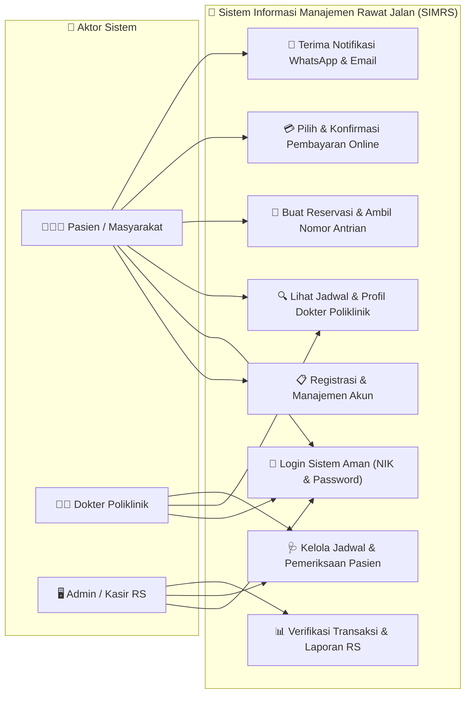
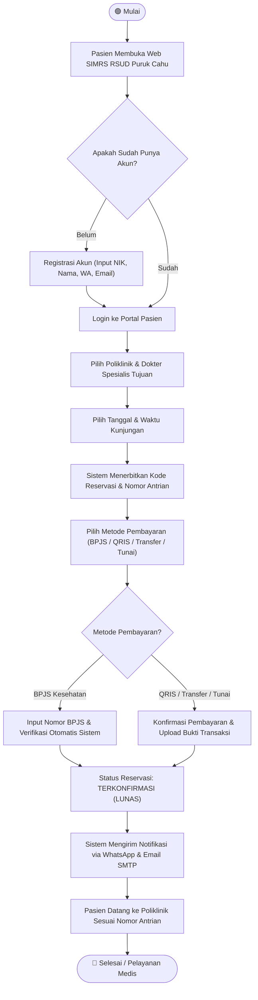
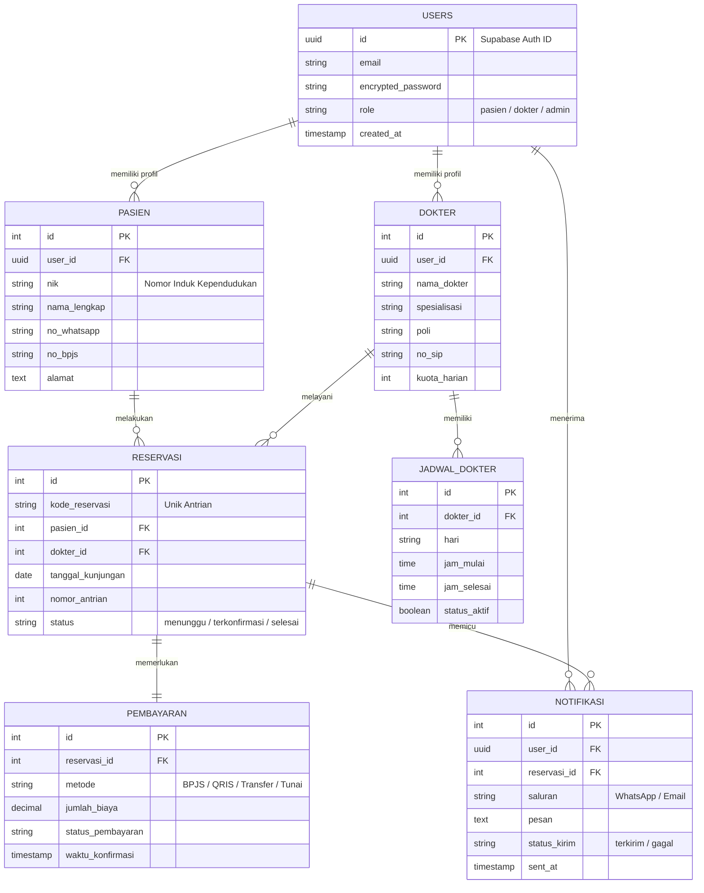
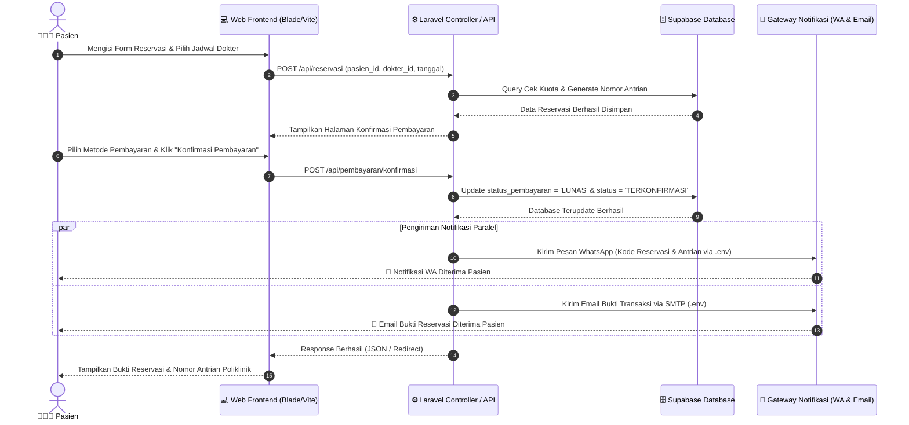
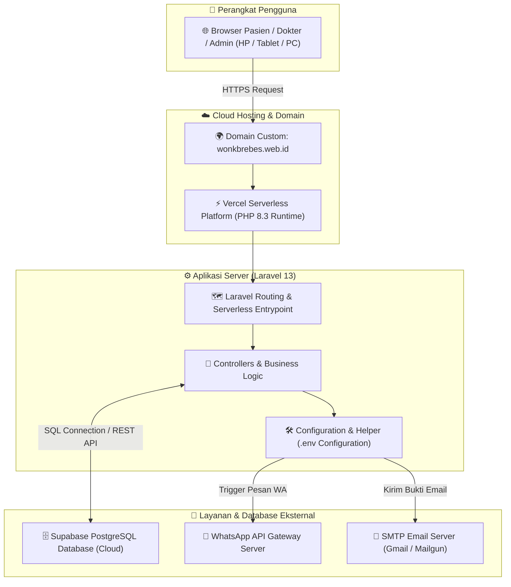

# 📊 Diagram Sistem SIMRS Rawat Jalan RSUD Puruk Cahu untuk Laporan Praktikum

Dokumen ini berisi kumpulan diagram analisis dan perancangan sistem yang lengkap dan formal, dirancang khusus untuk kebutuhan **Laporan Praktikum, Tugas Akhir, atau Laporan Magang**. Seluruh diagram dibuat menggunakan standar **Mermaid.js** yang bersih dan informatif.

Di bagian akhir dokumen ini juga tersedia **Panduan Mudah** untuk mengubah diagram ini menjadi gambar berkualitas tinggi (**PNG / JPEG / SVG**) agar bisa langsung disalin (*copy-paste*) ke Microsoft Word atau Google Docs.

---

## 1. Use Case Diagram (Diagram Interaksi Aktor & Sistem)
Diagram ini menggambarkan siapa saja aktor yang berinteraksi dengan sistem SIMRS dan fitur-fitur utama apa saja yang dapat mereka gunakan.



> **💡 Deskripsi untuk Laporan:** *Use Case Diagram di atas menunjukkan tiga aktor utama yaitu Pasien, Dokter, dan Admin RS. Pasien memiliki hak akses untuk melakukan pendaftaran mandiri, melihat jadwal dokter, melakukan reservasi antrian, melakukan konfirmasi pembayaran, serta menerima bukti transaksi otomatis melalui WhatsApp dan Email.*

---

## 2. Activity Diagram (Alur Reservasi dan Konfirmasi Pembayaran)
Diagram aktivitas ini memetakan urutan langkah (*workflow*) dari sudut pandang pasien mulai dari membuka situs web hingga menyelesaikan pelayanan poliklinik.



> **💡 Deskripsi untuk Laporan:** *Activity Diagram menggambarkan alur logika sistem dalam menangani reservasi. Terdapat logika pengecekan kondisi pada metode pembayaran: pasien BPJS akan melewati verifikasi nomor kartu, sedangkan pasien umum/QRIS melakukan konfirmasi pembayaran sebelum sistem mencetak bukti dan mengirimkan notifikasi.*

---

## 3. Entity Relationship Diagram (ERD - Desain Database Supabase)
Diagram ini merepresentasikan struktur tabel dalam database **Supabase PostgreSQL** beserta relasi antar tabel (Primary Key & Foreign Key).



> **💡 Deskripsi untuk Laporan:** *ERD menunjukkan skema relasional database aplikasi. Tabel `reservasi` menjadi pusat transaksi yang menghubungkan `pasien` dengan `dokter`, serta berkorelasi satu-ke-satu dengan tabel `pembayaran` dan memicu rekam jejak pada tabel `notifikasi`.*

---

## 4. Sequence Diagram (Proses Konfirmasi & Pengiriman Notifikasi)
Diagram sekuensial ini menjelaskan komunikasi antar komponen (*Frontend*, *Controller*, *Database*, dan *Gateway Notifikasi*) berdasarkan urutan waktu (sistem waktu nyata).



> **💡 Deskripsi untuk Laporan:** *Sequence Diagram mengilustrasikan mekanisme asinkron dan paralel pada saat pasien melakukan konfirmasi pembayaran. Setelah database Supabase berhasil diperbarui, controller Laravel secara bersamaan memanggil layanan pengiriman pesan WhatsApp dan email SMTP untuk memberikan konfirmasi instan kepada pasien.*

---

## 5. System Architecture / Deployment Diagram (Arsitektur Cloud)
Diagram ini memperlihatkan infrastruktur teknologi yang digunakan untuk menata aplikasi dari perangkat pengguna hingga deployment di domain kustom.



> **💡 Deskripsi untuk Laporan:** *Arsitektur sistem SIMRS dibangun dengan pendekatan moderncloud-native. Aplikasi berbasis Laravel 13 dipasang pada lingkungan serverless Vercel dengan domain kustom `wonkbrebes.web.id`. Penyimpanan data dipercayakan pada cloud database Supabase PostgreSQL, dan terhubung dengan gateway notifikasi eksternal.*

---

## 🛠️ Panduan Mengubah Diagram Menjadi Gambar (PNG / JPG) untuk Word

Agar Anda dapat dengan mudah memasukkan diagram di atas ke dalam file **Microsoft Word** atau **Google Docs**, pilih salah satu dari 3 cara termudah berikut:

### Cara 1: Menggunakan Mermaid Live Editor (Paling Mudah & Rekomendasi)
1. Buka situs web resmi Mermaid Editor: **[https://mermaid.live](https://mermaid.live)**
2. Salin (*copy*) kode diagram di atas (hanya bagian teks di dalam blok ````mermaid ... ````, tanpa tanda backtick ````).
3. Tempel (*paste*) kode tersebut di kotak kolom sebelah kiri situs Mermaid Live.
4. Diagram akan langsung otomatis tergambar di kolom sebelah kanan!
5. Klik tombol **Actions** (di sudut kanan atas) -> pilih **Export PNG** atau **Export SVG**.
6. Simpan gambar di laptop Anda, lalu tinggal *Insert -> Picture* di Microsoft Word!

### Cara 2: Menggunakan Visual Studio Code (VS Code)
1. Jika Anda membuka file markdown ini di VS Code, install ekstensi gratis bernama **"Markdown Preview Mermaid Support"** atau **"Mermaid Export"**.
2. Klik kanan pada blok diagram Mermaid -> pilih **"Export Diagram as PNG"**.
3. Gambar siap disalin ke laporan Anda.

### Cara 3: Screenshot Langsung dari Layar
1. Karena diagram di atas akan dirender secara visual dalam antarmuka obrolan ini (atau di preview Markdown GitHub/VS Code), Anda dapat langsung membesarkan tampilan layar.
2. Gunakan **Snipping Tool** (Windows + Shift + S) di Windows Anda untuk memotong gambar diagram dengan rapi.
3. Tempel (*Paste* / Ctrl + V) langsung ke dokumen Word laporan praktikum Anda.
