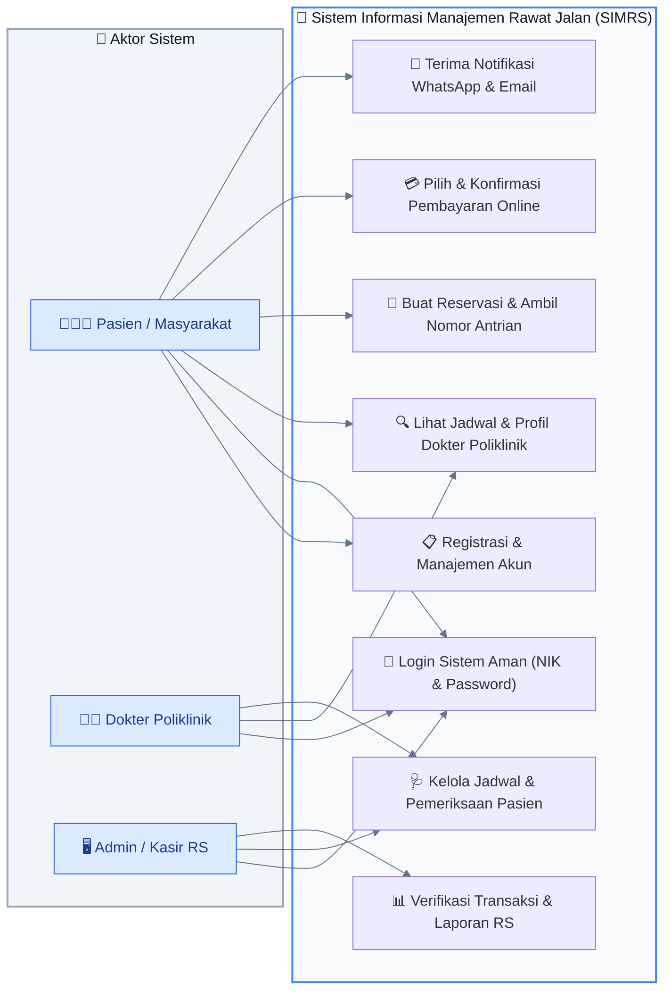
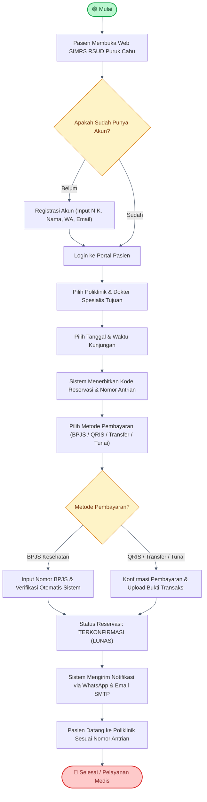
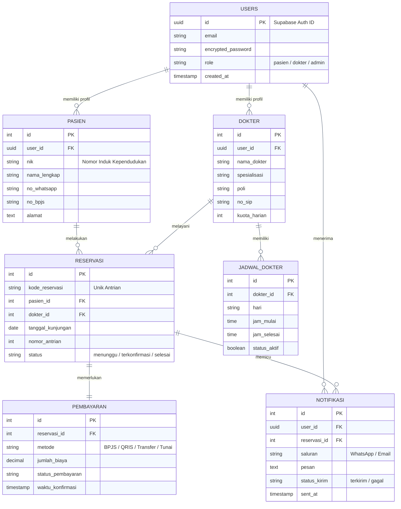
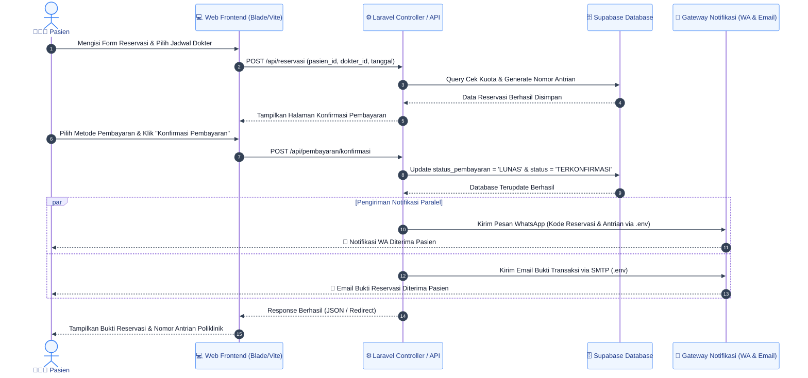
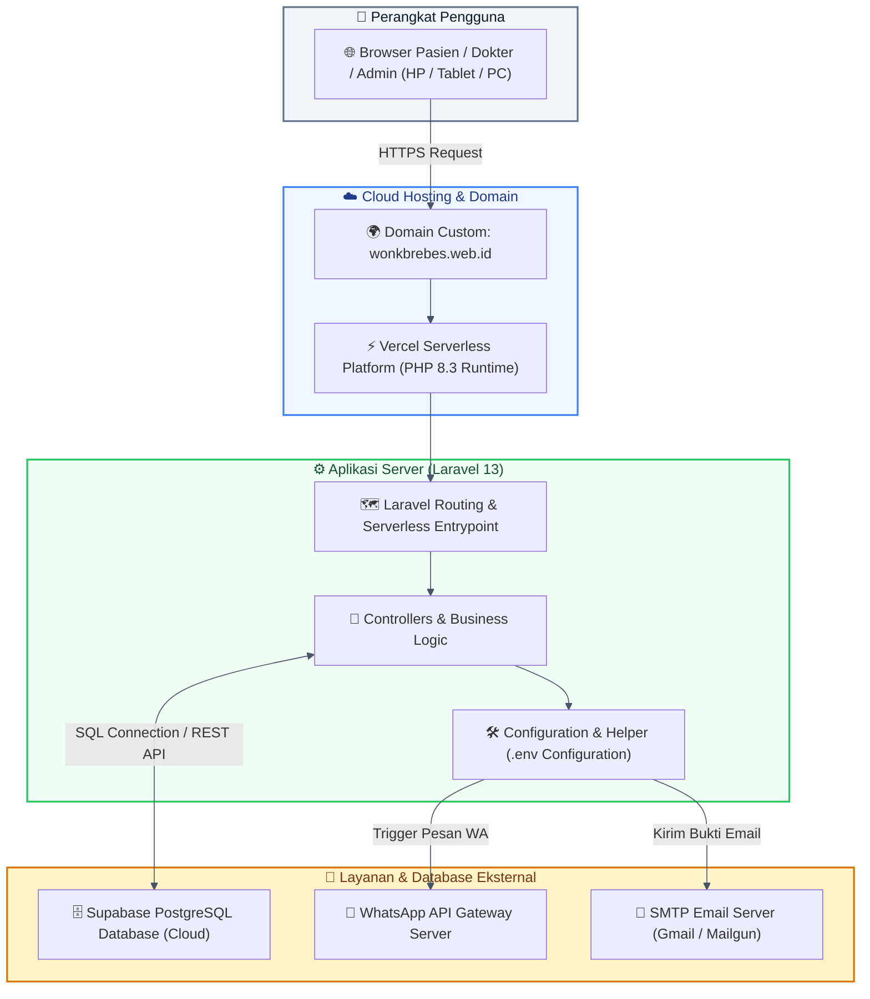

# 📊 Diagram Sistem SIMRS Rawat Jalan RSUD Puruk Cahu (Latar Belakang Putih)

Dokumen ini berisi kumpulan diagram analisis dan perancangan sistem yang telah dikonfigurasi khusus dengan **Latar Belakang Putih Bersih (Solid White Background)** dan kontras teks gelap. Format ini sangat wajib dan ideal untuk dipasang pada **Laporan Praktikum, Tugas Akhir, atau Skripsi** yang dicetak pada kertas putih.

---

## 💡 Cara Paling Cepat Export Gambar Berlatar Putih di [mermaid.live](https://mermaid.live):
1. Salin kode diagram di bawah ini (tanpa tanda ````mermaid).
2. Tempel di kolom kiri situs **[https://mermaid.live](https://mermaid.live)**.
3. **PENTING:** Di panel bawah atau menu **Theme / Background**, pastikan Anda memilih **"Light"** atau **"White"** (jangan *Dark* atau *Transparent*).
4. Klik tombol **Actions** (sudut kanan atas) -> pilih **Export PNG**. Gambar PNG berlatar putih bersih siap disalin ke Word!

---

## 1. Use Case Diagram (Latar Putih Formal)



---

## 2. Activity Diagram (Alur Reservasi & Konfirmasi Pembayaran)



---

## 3. Entity Relationship Diagram (ERD - Skema Database Supabase)



---

## 4. Sequence Diagram (Proses Konfirmasi & Pengiriman Notifikasi)



---

## 5. System Architecture / Deployment Diagram (Arsitektur Cloud)


